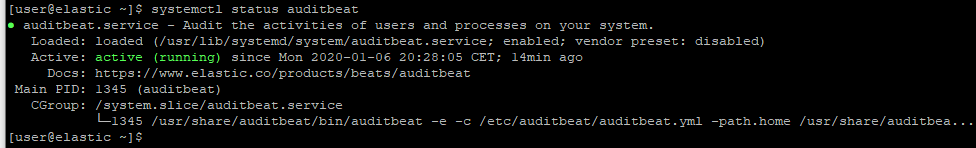

# 0 Lange nicht da - Alles Okay?
## login
  * ssh in die Laborumbgebung
  * von da aus
    * ssh student(nummer)
	* ssh root@ms(nummer)
	
## 0.1 Elastick: läuft unser "Stack" noch?
  * elasticsearch  
    *  systemctl status elasticsearch
    
     *  sudo journalctl -u elasticsearch
     *  sudo tail -f /var/log/elasticsearch/elasticsearch.log
     *  if-not: 
         * sudo systemctl start elasticsearch
         * sudo systemctl enable elasticsearch

  * kibana   
     *  systemctl status kibana
      
     *  sudo journalctl -u kibana
     *  netstat -tuan |grep 5601
     *  [http://localhost:5601/](http://localhost:5601/)
     *  if-not: 
         *  sudo systemctl start kibana
         *  sudo systemctl enable kibana

## 0.2 Metasploitable: läuft noch?
  * auditbeat
    *  systemctl status auditbeat
    
    *  sudo journalctl -u auditbeat
    *  if-not: 
         *  sudo systemctl start auditbeat
         *  sudo systemctl enable auditbeat

# 1 Packetbeat
  * install
    * sudo yum install --enablerepo=elasticsearch packetbeat
    * sudo systemctl enable packetbeat
    * sudo systemctl start packetbeat
    * (evtl schon installiert: sudo yum imstall libpcap)
  * config
    * sudo vim /etc/packetbeat/packetbeat.yml
      *  check if "packetbeat.interfaces.device: any"

