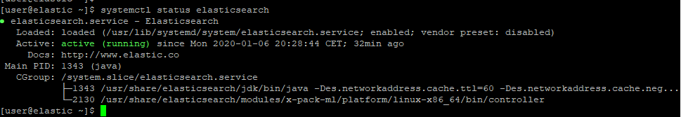
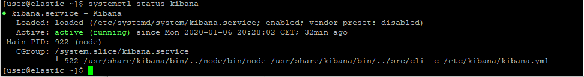

# 0 Lange nicht da - Alles Okay?
## login
  * ssh in die Laborumbgebung
  * von da aus
    * ssh student(nummer)
	* ssh root@ms(nummer)
	
## 0.1 Elastick: läuft unser "Stack" noch?
  * elasticsearch  
    *  systemctl status elasticsearch
    
     *  sudo journalctl -u elasticsearch
     *  sudo tail -f /var/log/elasticsearch/elasticsearch.log
     *  if-not: 
         * sudo systemctl start elasticsearch
         * sudo systemctl enable elasticsearch

  * kibana   
     *  systemctl status kibana
      
     *  sudo journalctl -u kibana
     *  netstat -tuan |grep 5601
     *  [http://localhost:5601/](http://localhost:5601/)
     *  if-not: 
         *  sudo systemctl start kibana
         *  sudo systemctl enable kibana

## 0.2 Metasploitable: läuft noch?
  *
  * filebeat
    *  filebeat -c /etc/filebeat/filebeat.yml -e
  * Packetbeat
   * /etc/init.d/packetbeat status
	 /etc/init.d/packetbeat: line 139: status_of_proc: command not found
	 /etc/init.d/packetbeat stop
     /etc/init.d/packetbeat start

#1 Enable "security" in ES
* https://www.elastic.co/guide/en/elasticsearch/reference/current/security-getting-started.html folgen bi create user, keine weiteren User anlegen.
* https://www.elastic.co/guide/en/elasticsearch/reference/current/configuring-security.html

pm_system, beats_system, elastic, kibana_system, logstash_system, remote_monitoring_user.


 ## Alles(?) wieder gangbar machen
 
### kinbana 
 ```
./bin/kibana-keystore create --allow-root
./bin/kibana-keystore add elasticsearch.username --allow-root
./bin/kibana-keystore add elasticsearch.password --allow-root
```

### filebeat auf MS

* bitte ersteinmal beats_system user nehmen, dann einen anderen, der mehr Privilegien hat, dann eine neue Rolle und einen entsprechenden User anlegen (s.U.)
* https://www.elastic.co/guide/en/elasticsearch/reference/current/get-started-users.html 
* https://www.elastic.co/guide/en/elasticsearch/reference/current/get-started-roles.html adaptieren Sie den metricbeat user und die Rolle auf unsere umgebung (beats_writer z.b.)